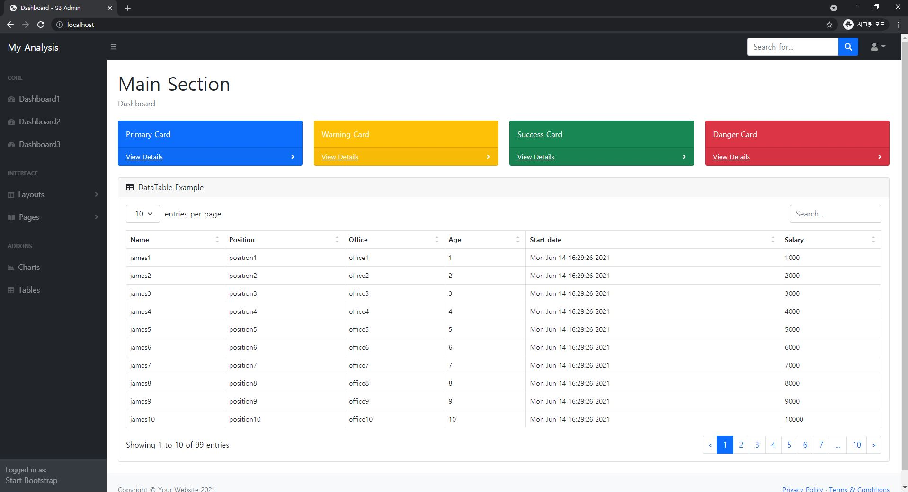
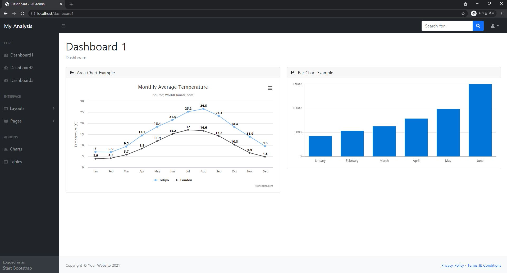
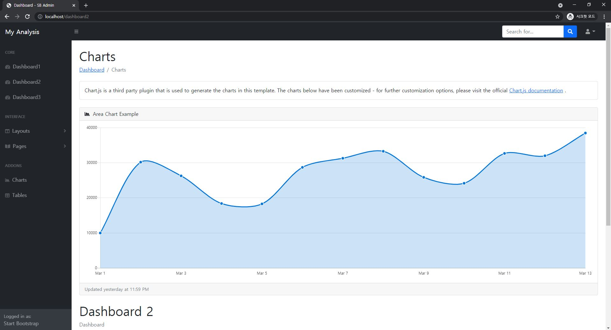
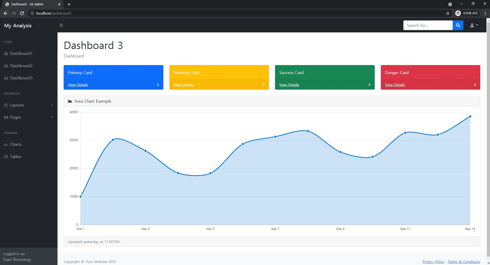

# bootstrap

> 사용자가 데이터들을 직관적으로 보기 쉽게 만들어주는 UI 템플릿

- 프로젝트명 : dashboard
- app명 : dashboard
- 사용한 템플릿
  1. [부트스트랩(SB Admin)](https://startbootstrap.com/template/sb-admin)
  2. [하이차트(line-labels)](https://www.highcharts.com/demo/line-labels)

## 결과 화면

- [index.html](./dashboard/templates/index.html)
- [main_section.html](./dashboard/templates/main_section.html)

- [dashboard1.html](./dashboard/templates/dashboard1.html)

- [dashboard2.html](./dashboard/templates/dashboard2.html)

- [dashboard3.html](./dashboard/templates/dashboard3.html)

