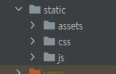

# bootstrap

> 사용자가 데이터들을 직관적으로 보기 쉽게 만들어주는 UI 템플릿

- 프로젝트명 : **dashboard**
- app명 : **dashboard**
- 사용한 템플릿
  1. [부트스트랩(SB Admin)](https://startbootstrap.com/template/sb-admin)
  2. [하이차트(line-labels)](https://www.highcharts.com/demo/line-labels)


## 1. 구현 내용

1. **부트스트랩 코드 붙이기**

   - 

2. **index.html 수정**

   - main 화면 모듈화 → *main_section.html*

   - ```django
     <!-- index.html -->
     
     <!-- start main -->
     
     	
     
     	
     
     <!-- end main -->
     ```

3. **메뉴 추가**

   - *dashboard1*, *dashboard2*, *dashboard3*

   - ```django
     <!-- index.html -->
     
     <a class="nav-link" href="">
     	<div class="sb-nav-link-icon"><i class="fas fa-tachometer-alt"></i></div>
     	Dashboard1
     </a>
     <a class="nav-link" href="">
     	<div class="sb-nav-link-icon"><i class="fas fa-tachometer-alt"></i></div>
     	Dashboard2
     </a>
     <a class="nav-link" href="">
     	<div class="sb-nav-link-icon"><i class="fas fa-tachometer-alt"></i></div>
     	Dashboard3
     </a>
     ```

4. **서버에서 데이터 가져와서 화면에 테이블 출력**

   - ```python
     # views.py
     
     def home(request):
     	data = []
     	for i in range(1, 100):
     		person = {}
     		person['name'] = 'james' + str(i)
     		person['position'] = 'position' + str(i)
     		person['office'] = 'office' + str(i)
     		person['age'] = i
     		person['salary'] = i * 1000
     		person['date'] = time.ctime()
     		data.append(person)
     
     	context = {
     		'section': 'main_section.html',
     		'persons': data,
     	}
     	return render(request, 'index.html', context)
     ```

   - ```django
     <!-- main_section.html -->
     
     <tbody>
     
     	<tr>
     		<td>{{p.name}}</td>
     		<td>{{p.position}}</td>
     		<td>{{p.office}}</td>
     		<td>{{p.age}}</td>
     		<td>{{p.date}}</td>
     		<td>{{p.salary}}</td>
     	</tr>
     
     </tbody>
     ```

5. **ajax 통신하여 데이터 받은 후 Hichart 템플릿 적용**

   - ```javascript
     // dashboard.html
     
     function getdata() {
         $.ajax({
             url: 'chart1',
             datatype: 'JSON',
             success: function(data) {
                 console.log(data);
                 display(data)
             },
             error: function() {
                 console.log("error");
             }
         });
     }
     ```

   - ```python
     # views.py
     
     def chart1(request):
     	data = [
     		{'name': 'Tokyo', 'data': [7.0, 6.9, 9.5, 14.5, 18.4, 21.5, 25.2, 26.5, 23.3, 18.3, 13.9, 9.6]},
     		{'name': 'London', 'data': [3.9, 4.2, 5.7, 8.5, 11.9, 15.2, 17.0, 16.6, 14.2, 10.3, 6.6, 4.8]}
     	]
     	return HttpResponse(json.dumps(data), content_type='application/json')
     ```


## 2. 결과 화면

- [index.html](./dashboard/templates/index.html)
- [main_section.html](./dashboard/templates/main_section.html)


- [dashboard1.html](./dashboard/templates/dashboard1.html)


- [dashboard2.html](./dashboard/templates/dashboard2.html)


- [dashboard3.html](./dashboard/templates/dashboard3.html)


