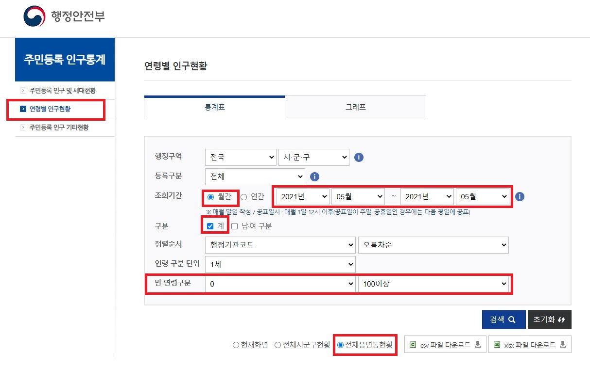
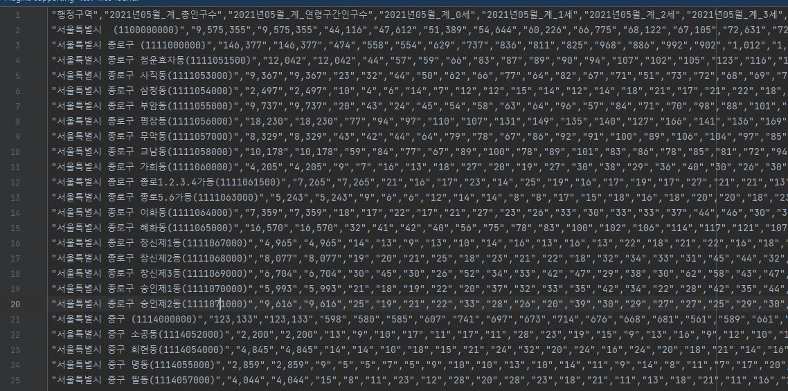
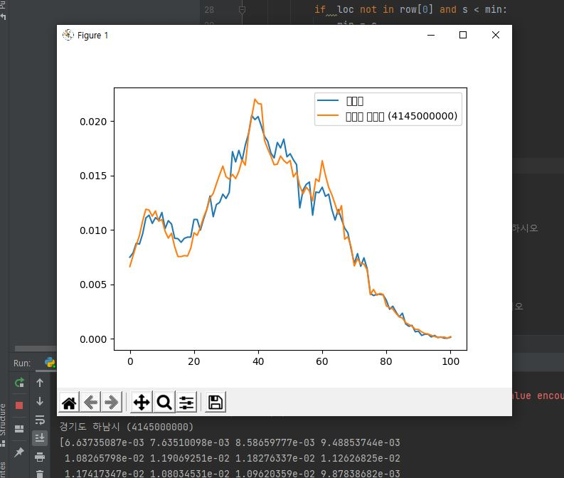
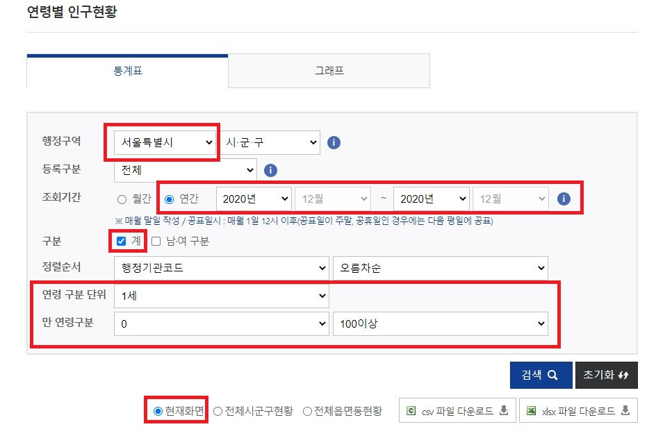
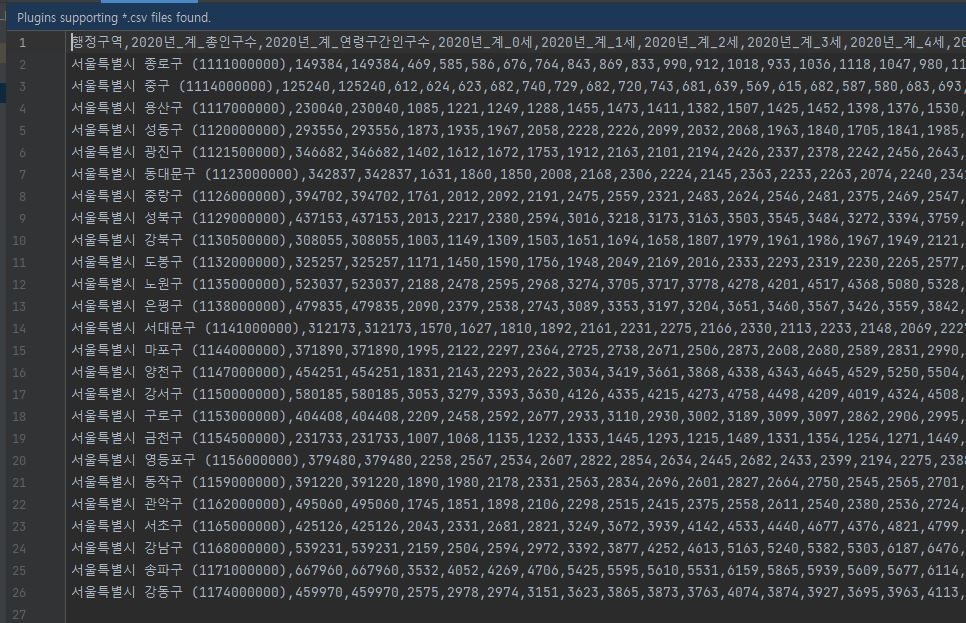
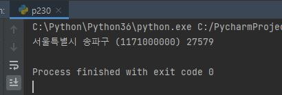
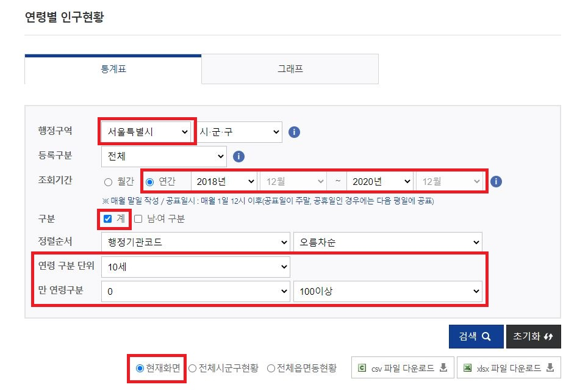
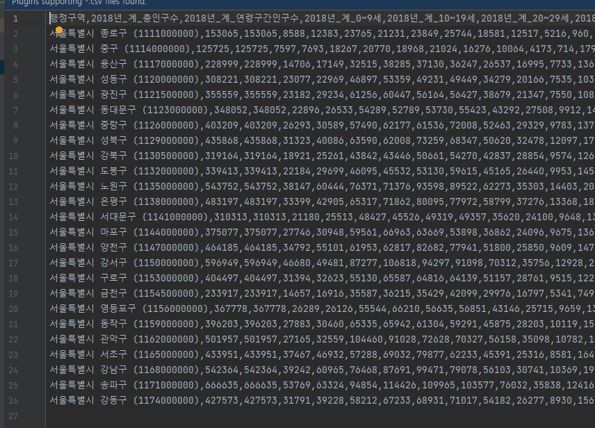
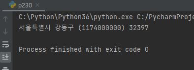

# Numpy

> 행렬이나 대규모 다차원 배열을 쉽게 처리할 수 있도록 지원하는 파이썬 라이브러리


## 1. numpy 문법

```python
import numpy as np

list = np.array([1,2,3])
print(list)
```


## 2. numpy 실습

```python
import numpy as np

ldata = [1, 2, 3, 4, 5]
print(ldata)    # [1, 2, 3, 4, 5]
print(type(ldata)) # <class 'list'>
print(ldata[2:]) # [3, 4, 5]

ndata = np.array(ldata)
print(ndata)    # [1 2 3 4 5]
print(type(ndata))  # <class 'numpy.ndarray'>
print(ndata[2:])    # [3 4 5]

a = np.eye(5)
print(a)   
# [[1. 0. 0. 0. 0.]
#  [0. 1. 0. 0. 0.]
#  [0. 0. 1. 0. 0.]
#  [0. 0. 0. 1. 0.]
#  [0. 0. 0. 0. 1.]]

#print(ldata + 5)
print(ndata / 5)    # [0.2 0.4 0.6 0.8 1. ]
ndatas = np.sqrt(ndata)
print(ndatas)   # [1.         1.41421356 1.73205081 2.         2.23606798]

ndata2 = np.zeros(5)
print(ndata2 + 6)   # [6. 6. 6. 6. 6.]

ndata3 = np.arange(-5, 5)
print(ndata3)   # [-5 -4 -3 -2 -1  0  1  2  3  4]
print(ndata3 > 2)   # [False False False False False False False False  True  True]
print(ndata3[ndata3 > 2])   # [3 4]

data1 = [10,9,33,88,66,55,40]

ndata1 = np.array(data1)
result = ndata1[ndata1 > 50]
print(result)   # [88 66 55]

# 짝수만 result2에 추츨 하시오
result2 = ndata1[ndata1 % 2 == 0]
print(result2)  # [10 88 66 40]
result3 = result2.tolist()
print(result3)  # [10, 88, 66, 40]
```


## 3. 인구조사 실습1

- '신도림' 지역의 인구와 가장 유사한 지역을 찾아보자!!

  

1. 데이터 수집

   - [행정안전부 - 연령별 인구현황](https://jumin.mois.go.kr/index.jsp)

   - 

   - 

   - csv.reader()한 데이터는 일반적인 리스트가 아니기 때문에 <u>한번 전체 for문으로 순회하면 데이터가 사라진다.</u> 그래서 reader를 하면 **list**형태로 바꿔주도록 하자!!

   - ```python
     import csv
     import numpy as np
     
     class p230:
         def p248(self, loc):
             f = open('age.csv')
             data = csv.reader(f)
             next(data)
             print(type(data))
             data = list(data)
             print(type(data))
     
     if __name__ == '__main__':
         p230().p248('신도림')
         
     ''' 출력 결과
     C:\Python\Python36\python.exe C:/PycharmProjects/03_numpy_pandas/numpan/p230.py
     <class '_csv.reader'>
     <class 'list'>
     '''
     ```

2. 데이터 처리

   - 2-1) '신도림' 지역의 연령별 비율 구하기

   - ```python
     # 신도림의 연령별 비율
     for row in data:
     	if loc in row[0]:
     		home = np.array(row[3:], dtype=int)
     		home2 = home / int(row[2].replace(',',''))
     ```

   - 2-2) 모든 지역의 연령별 비율 구하기

   - 2-3) '신도림' 지역과 '전지역'의 각 연령대 비율을 빼고 그 값이 가장 낮은 지역을 찾는다.

   - ```python
     # 모든 지역의 연령별 비율을 구한다.
     min = 987654321
     result = None
     result_name = None
     	for row in data:
     		away = np.array(row[3:], dtype=int)
             away2 = away / int(row[2].replace(',',''))
             s = np.sum(np.abs(home2 - away2))
             if  loc not in row[0] and s < min:
             	min = s
                 result = away2
                 result_name = row[0]
     ```

   - 2-4) 두 지역의 연령별 인구수를 pyplot 라이브러리를 이용하여 그래프로 시각화한다.

   - ```python
     plt.plot(home2, label=loc)
     plt.plot(result, label=result_name)
     plt.legend()
     plt.show()
     ```

3. 결과(출력 화면)

   - '경기도 하남시'가 '신도림' 지역과 가장 유사한 인구분포를 가지고 있다. 

   - 
   - [소스코드](./p230.py)


## 인구조사 실습2

- 서울시 영유아(5세이하)들이 가장 많이 사는 지역 구해보자


1. 데이터 수집

   - 
   - 

2. 데이터 처리

   - 0세부터 5세까지의 인원수를 전부 더하고 그 중 가장 큰값을 리턴

   - ```python
     def p231(self):
         # csv데이터 읽어오는 부분은 스킵
         max = 0
         max_loc = ''
         for row in data:
             rdata = np.array(row[3:9], dtype=int)
             sumdata = np.sum(rdata)
             if sumdata > max:
                 max = sumdata
                 max_loc = row[0]
         print(max_loc, max)
     ```

3. 결과(출력화면)

   - 
   - [소스코드](./p230.py)


## 인구조사 실습3

- 서울에서 3년간(18년~20년) 인구가 가장 많이 늘어난 구를 구하자!!


1. 데이터 수집

   - 
   - 

2. 데이터 처리

   - 20년 인구수에서 18년 인구수를 뺀 값 중에서 가장 큰 값을 리턴

   - ```python
     def p232(self):
         # csv데이터 읽어오는 부분은 스킵
     	max = 0
         loc = ''
         for row in data:
         	rdata = int(row[27]) - int(row[1])
             if rdata > max:
             	max = rdata
                 loc = row[0]
         print(loc, max)
     ```

3. 결과(출력화면)

   - 
   - [소스코드](./p230.py)
