# pandas

> 데이터 조작 및 분석을 위해 파이썬 프로그래밍 언어로 작성된 소프트웨어 라이브러리
>
> 특히, 수치 표와 시계열을 조작하기 위한 데이터구조와 연산을 제공


## 실습 1. Series

- pandas 라이브러리에는 기본적으로 2개의 주요 자료구조가 존재 : Series와 DataFrame
- Series는 1차원 배열, DataFrame은 2차원 배열

```python
import numpy as np
import pandas as pd

# python list
data = [1, 2, 3, 4, 5]

# numpy
ndata = np.array(data)

# series
pdata = pd.Series(data)
print(pdata[0])
print(pdata.values)
print(pdata.index)

pdata2 = pd.Series(data, index=['A', 'B', 'C', 'D', 'E'])
print(pdata2)
print(pdata2['C'])

# dic
data2 = {'name': 'kim', 'ko': 100, 'en': 90, 'ma': 80, 'si': 100}
pdata3 = pd.Series(data2)

pdata3.name = 'Score Name'
pdata3.index.name = 'Score Index name'
print(pdata3)
print(pdata3['name'])
print(pdata3.ko)
```

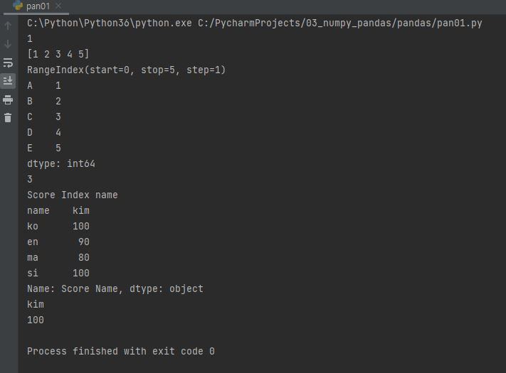


## 실습 2. index

```python
import numpy as np
import pandas as pd

data = np.arange(0, 5)
print(data)

idx = ['b', 'a', 'c', 'e', 'd']
pdata = pd.Series(data, index=idx)
#print(pdata[pdata > 0])
print(pdata)

pdata2 = pdata.reindex(np.sort(np.array(idx)))
print(pdata2)

idx.append('x')
idx.append('y')
pdata3 = pdata.reindex(idx, fill_value=0)
print(pdata3)
print(np.average(pdata3))
```

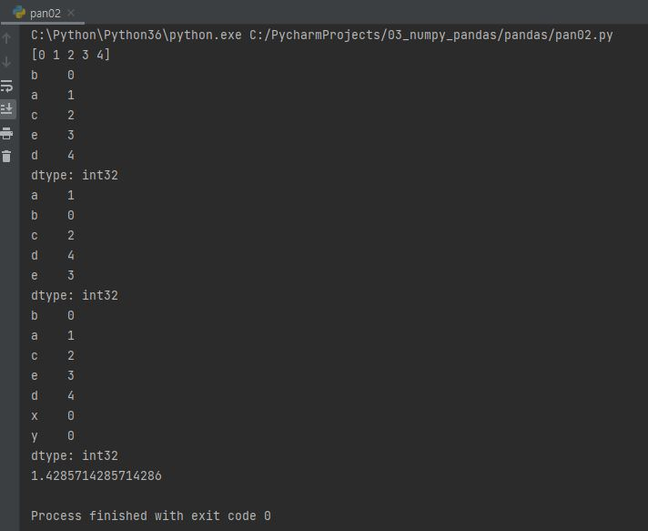


## 실습 3. DataFrame

```python
import pandas as pd

data1 = ['A', 2]
data2 = ['B', 4]

df1 = pd.DataFrame([data1, data2])
print(df1)

data = {
        'subject' : ['math', 'comp', 'phys', 'chem'],
        'score': [100, 90, 85, 95],
        'students': [94, 32, 83, 17]
}
df2 = pd.DataFrame(data)
print(df2)
print(len(df2))
print(df2.shape)
print(df2.shape[0])  # 행 정보
print(df2.shape[1])  # 열 정보

df3 = pd.DataFrame(df2, columns=['students', 'score', 'subject'])
print(df3)
print(df3['students'][2])
print(df3[df3['score'] > 90])

dic1 = {'math': {1: 80, 2: 90, 3: 100}, 'comp': {1: 90, 2: 100}}
df4 = pd.DataFrame(dic1)
print(df4)
```

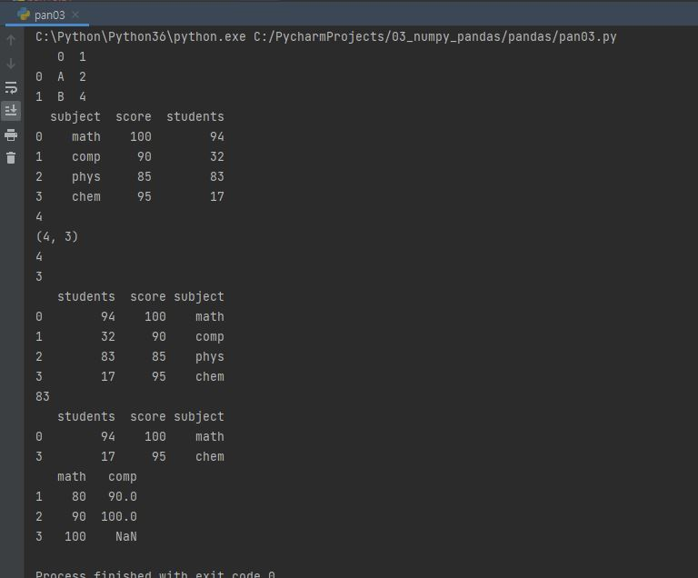


## 실습 4. numpy를 활용한 DataFrame

```python
import pandas as pd
import numpy as np

datas = np.random.randint(10, 100, (6, 4))
print(datas)
df = pd.DataFrame(datas)
df.columns = ['score1', 'score2', 'score3', 'score4']
df.columns = ['s1', 's2', 's3', 's4']
#df.index = pd.date_range('20210114', periods=6)
print(df)
```

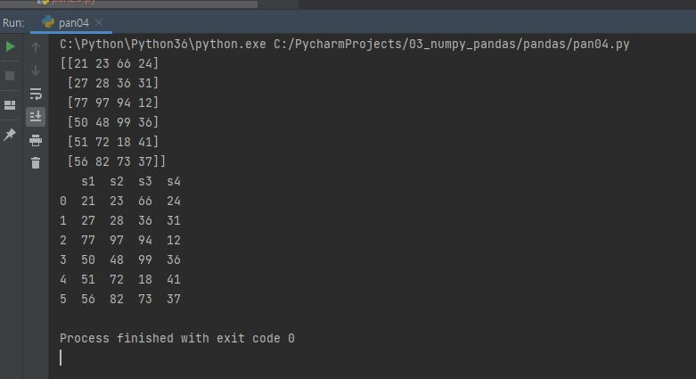


## 실습 5. DataFrame 인덱싱1

- 행을 참조할 때는 `loc`함수를 이용
- `loc[행 이름]` 을 하면 해당 행에 있는 칼럼에 따른 값을 출력
- `loc[행 이름, 열 범위]` 를 하게 되면 해당 행에 있는 열 범위의 칼럼 값이 출력

```python
import pandas as pd

data = {'subject': ['math', 'comp', 'phys', 'chem'], 'score': [100, 90, 85, 95], 'students': [94, 32, 83, 17]}

print(data, '\n')

df = pd.DataFrame(data, columns=['subject', 'score', 'students', 'class'])

df['class2'] = [1, 2, 3, 4]
df.index = ['one', 'two', 'three', 'four']
print(df, '\n')
print(df.columns)
print(df.index, '\n')

print(df['subject'], '\n')
print(df.subject, '\n')

# df2 = df[['score','class2']]
# print(df2)

print(df[['subject', 'score']], '\n')

print(df.loc['two', 'score': 'class'], '\n')
print(df.loc['two', ['score', 'students', 'class2']], '\n')
```

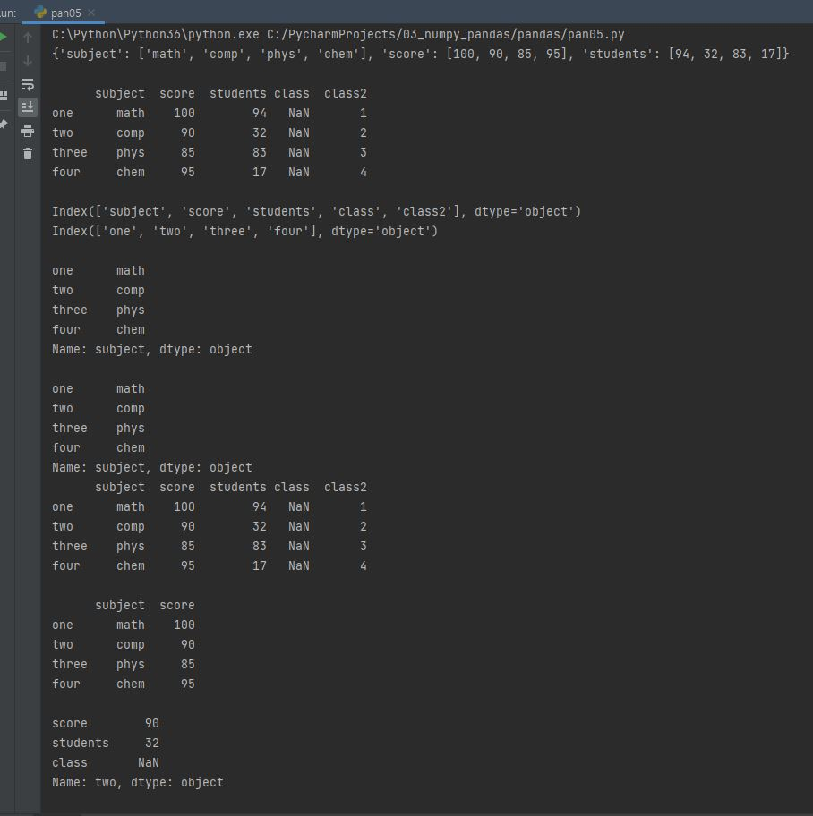


## 실습 6. DataFrame 인덱싱2

- `iloc` 을 이용하면 인덱스 값을 이용하여 위치를 참조할 수 있다.
- `iloc[1]` : 1행의 값들 (두번째 행)
- `iloc[1:]` : 1행~의 값들 (두번째 행부터 마지막행 까지)

```python
import pandas as pd

data = {'subject': ['math', 'comp', 'phys', 'chem'], 'score': [100, 90, 85, 95], 'students': [94, 32, 83, 17]}

df = pd.DataFrame(data)
df['score2'] = [90, 89, 98, 97]
print(df)
print(df.iloc[0:2, 1:3])

print('---------------------------')
print(df[['score', 'score2']])
print(df.loc[1, ['score', 'score2']])
print(df.loc[0:2, 'subject':'students'])
```

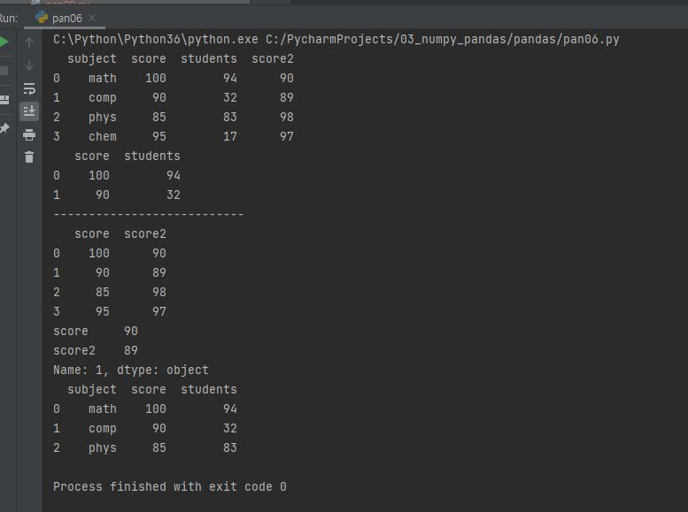


## 실습 7. DataFrame 인덱싱3

- 논리형 인덱싱이 가능하다

```python
import pandas as pd

data = {'subject': ['math', 'comp', 'phys', 'chem'], 'score': [100, 90, 85, 95], 'students': [94, 32, 83, 17]}

df = pd.DataFrame(data)

print(df)

df2 = df[df['score'] > 90]
print(df2[['score', 'students']])

print(df.loc[df['score'] > 90, ['score', 'students']])

print('--------------------------------------------')
df3 = df.copy()
print(df3)
df3.loc[df3['score'] > 90, 'score'] = 200
print(df3)
```

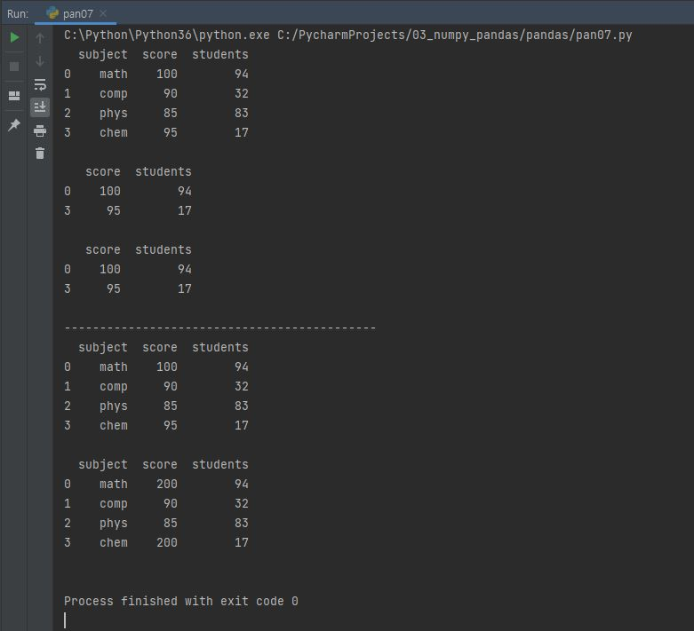


## 실습 8. DataFrame 인덱싱 실습

```python
import pandas as pd

data = {
    'name': ['james1', 'james2', 'james3', 'james4', 'james5'],
    'ko': [100, 90, 89, 99, 89],
    'en': [99, 91, 87, 89, 81],
    'ma': [80, 92, 88, 99, 87],
    'si': [99, 100, 87, 93, 86],
}

df = pd.DataFrame(data)
print(df, '\n')

# 1. 인덱스 값을 이름으로 변경 하시오
df.index = data['name']
print('#1', df, '\n')
del df['name']
print(df, '\n')

# 2. james3의 점수를 출력 하시오
print('#2', df.loc['james3'], '\n')
print(df.iloc[2], '\n')

# 3. ko 점수가 90점 이상인 학생의 정보를 출력 하시오
print('#3', df[df['ko'] > 90], '\n')
print(df.loc[df['ko'] > 90], '\n')

# 4. ko 점수가 90점 이상인 학생의 이름과 en 점수를 출력 하시오
print('#4', df.loc[df['ko'] > 90, 'en'], '\n')
print(df.loc[df['ko'] > 90, ['en', 'si']], '\n')

# 5. james4의 ma, si  점수만 출력 하시오
print('#5', df.loc['james4', ['ma', 'si']], '\n')
print(df.iloc[3, 2:4], '\n')

# 6.df를 df2 로 복사하여 en 점수가 90점 미만인 학생의 점수는 모두 90점으로 변경 하시오
df2 = df.copy()
df2.loc[df['en'] < 90, 'en'] = 90
print('#6', df2)
```

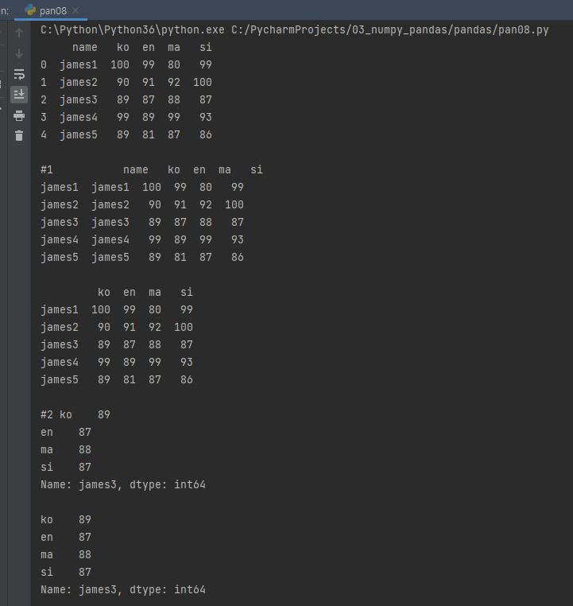

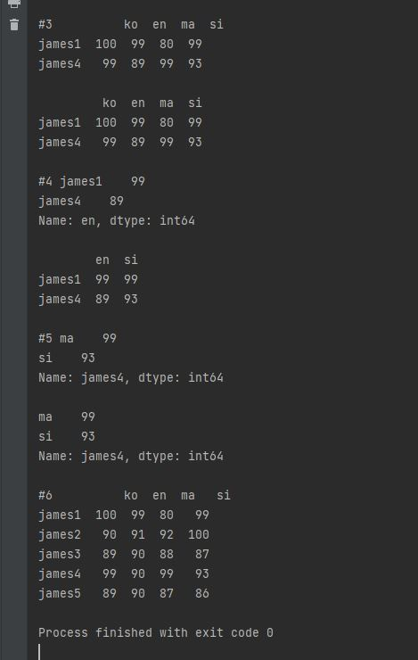


## 실습 9. DataFrame 행열 편집

```python
import pandas as pd

data = {'subject': ['math', 'comp', 'phys', 'chem'], 'score': [100, 95, 80, 90], 'students': [87, 39, 50, 72]}
df = pd.DataFrame(data, columns = ['subject', 'score', 'students', 'class'])
df.index = ['one', 'two', 'three', 'four']
print('#1', df, '\n')
print('#2', df.shape, df.shape[0], '\n')

df2 = pd.DataFrame(data)
new_df = df2.copy()
print('#3', df2, '\n')

df2.loc[df2.shape[0]] = ['korea', 80, 78]
print('#4', df2, '\n')

df2.loc['total'] = ['eng', 99, 89]
print('#5', df2, '\n')

df2['score2'] = [99, 88, 99, 77, 66, 44]
print('#6', df2, '\n')

del df2['subject']
print('#7', df2, '\n')

df3 = df2.drop('students', axis=1)
print('#8', df3, '\n')

df4 = df2.drop(['score', 'score2'], axis=1)
print('#9', df4, '\n')

df5 = df2.drop('total', axis=0)
print('#10', df5, '\n')

print('#11', new_df, '\n')
print('#12', new_df['score'].tolist(), '\n')
print('#13', new_df.loc[2].tolist(), '\n')
print('#14', new_df['score'].to_numpy(), '\n')
```

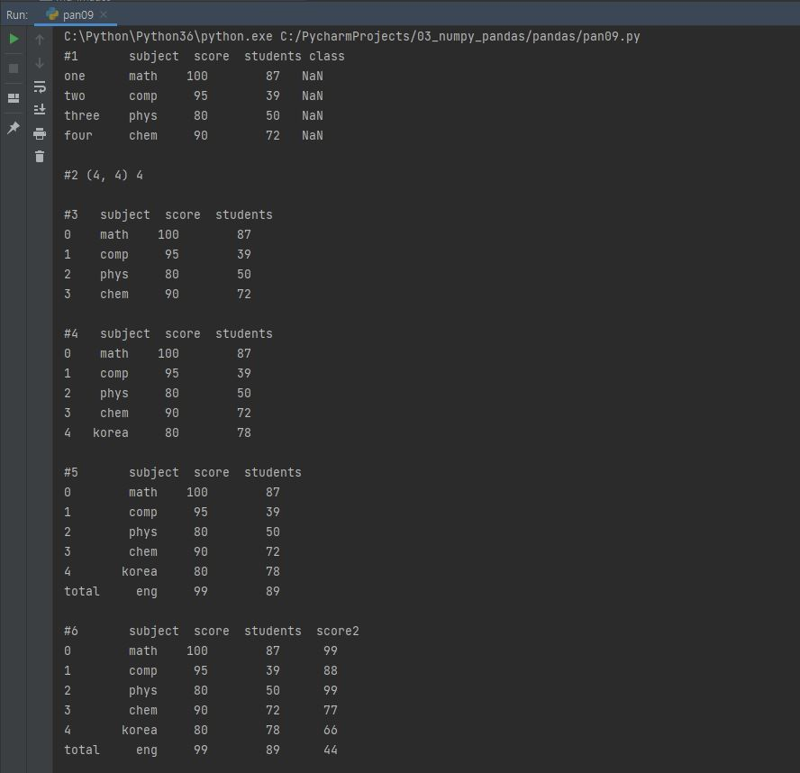

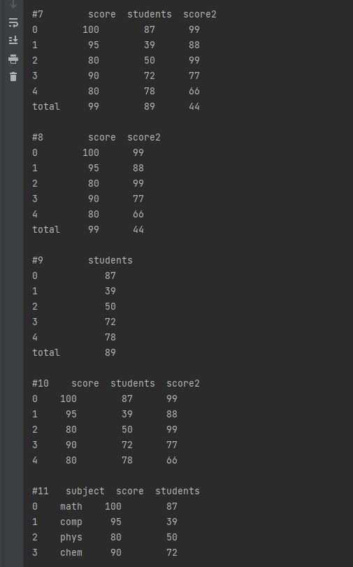

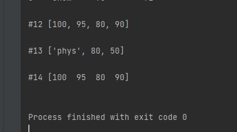


## 실습 10. DataFrame NaN 처리

- `copy()` 함수 없이 이용할 시 원본 데이터프레임 값이 바뀔 수 있다.
- Series를 이용하여 데이터를 넣을때 인덱스 값을 설정해줘야 한다.
- `dropna()`
- `fillna()`

```python
import pandas as pd
import numpy as np

data = {'subject': ['math', 'comp', 'phys', 'chem'], 'score': [100, 95, 80, 90], 'students': [87, 39, 50, 72]}
df = pd.DataFrame(data, columns = ['subject', 'score', 'students', 'class'])
print('#1', df, '\n')
#df['class'] = [1,2,3,4]
df2 = df.copy()
df2.index = ['a', 'b', 'c', 'd']
data = [5, 6, 7, 8]
ser1 = pd.Series(data)
ser1.index = df2.index
print('#2', ser1, '\n')

df2['class'] = ser1
print('#3', df2, '\n')

print('----------------------')
df2['pass'] = (df2['score'] >= 90)
df2['average'] = [96.4, np.NaN, 77.6, 98.0]
print('#4', df2, '\n')

df3 = df2.dropna()
print('#5', df3, '\n')

df4 = df2.fillna(value=0)
print('#6', df4)
```

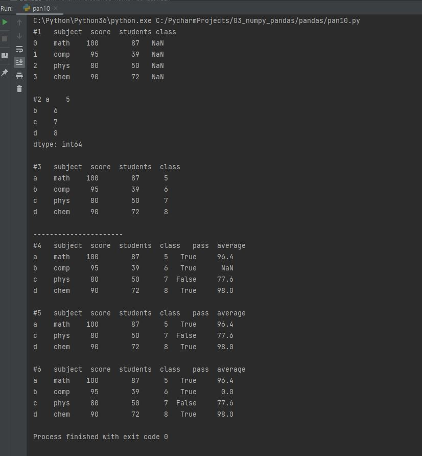


## 실습 11. 연산자 및 연산함수

```python
import pandas as pd
import numpy as np

data = [1, 2, 3, 4]
print('#1', data * 2, '\n')

n1 = np.array(data)
print('#2', n1 + 2, '\n')

p1 = pd.Series(data)
print('#3', p1, '\n')

p2 = p1.copy()
p2[4] = 10
print('#4', p1 / p2, '\n')

print('----------------------------------------')

x = pd.DataFrame(np.arange(12).reshape(3, 4), columns=list('abcd'))
print('#5', x, '\n')
xx = x.loc[1]   # 4,5,6,7
print('#6', x.add(xx), '\n') # x + xx
print('#7', x + [9, 9, 9, 9], '\n')
```

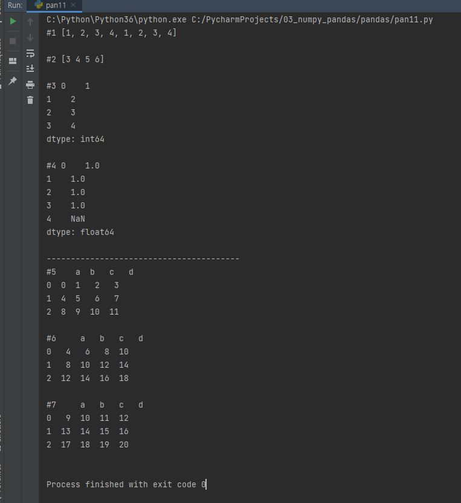


## 실습 12. 통계 함수

- `skipna=False` 는NaN을 무시하지 않는다.
- `axis` 를 넣어 행/열을 선택할 수 있다.
- `count()` : NaN을 제외한 전체 개수
- `mean()` : 평균
- `median()` : 중간값
- `mad()` : absolute deviation의 평균
- `corr()` : 상관 계수
- `cor()` : 공분산
- `std()` : 표준 편차
- `var()` : 분산
- `min()` : 최솟값
- `max()` : 최댓값
- `idxmin()` : 최솟값의 인덱스
- `idxmax()` : 최댓값의 인덱스

```python
import pandas as pd
import numpy as np

data = [[1.4, np.nan], [8.3, -2.1], [0.02, -1.11], [np.nan, np.nan]]
x = pd.DataFrame(data, columns=['one', 'two'], index=['a', 'b', 'c', 'd'])

print('#1', x, '\n')
print('------------------')
print('#2', x.sum(), '\n')
print('#3', x.sum(axis=0, skipna=False), '\n')
print('#4', x.sum(axis=1, skipna=False), '\n')
print('------------------')
print('#5', x['one'].sum(), '\n')
print('#6', x.loc['a'].sum(), '\n')
print('------------------')
print('#7', x.mean(), '\n')
print('#8', x.mean(axis=1), '\n')
print('------------------------------------------------')

data = {
    'name': ['james1', 'james2', 'james3', 'james4', 'james5'],
    'ko': [100, 90, 89, 99, 89],
    'en': [99, 91, 87, 89, 81],
    'ma': [80, 92, 88, 99, 87],
    'si': [99, 100, 87, 93, 86],
}

df = pd.DataFrame(data)
print('#9', df, '\n')

# 1. 인덱스 값을 이름으로 변경 하시오
df.index = data['name']
print('#10', df, '\n')
del df['name']
print('#11', df, '\n')

# 학생 별 합(sum), 평균(avg) 컬럼을 추가 한다.
# 과목 별 합(sum), 평균(avg) row를 추가 한다.
new_df = df.copy()
new_df['sum'] = new_df.iloc[:, 0:4].sum(axis=1)
new_df['avg'] = new_df.iloc[:, 0:4].mean(axis=1)
print('-----')
new_df.loc['sum'] = new_df.iloc[0:new_df.shape[0], :].sum()
new_df.loc['avg'] = new_df.iloc[0:new_df.shape[0]-1, :].mean()
print('#12', new_df, '\n')

# 국어 평균 점수 보다 높은 학생들을 조회 하시오
print('#13', df, '\n')
df2 = df[df['ko'] > df['ko'].mean()]
print('#14', df2, '\n')


# df2 = df[df['ko'] > df.loc['avg'][0]]
# df2 = df2.drop('sum',axis=0)
# print(df2)
# 전체 평균 보다 높은 학생들을 조회 하시오
# df3 = df[df['avg'] > df.loc['avg'][5]]
# df3 = df3.drop('sum',axis=0)
# print(df3)

print('------------------------------------------')
print('#15', df, '\n')
print('#16', df.min(), '\n')
print('#17', df.max(), '\n')
print('#18', df.min(axis=1), '\n')
print('#19', df.max(axis=1), '\n')
print('#20', df.idxmin(), '\n')
print('#21', df.idxmax(), '\n')

df5 = df.idxmax()
df5 = pd.DataFrame(df5, columns=['name'])
df5['score'] = df.max()
print('#22', df5, '\n')

# dic 만들어 보자
dic1 = {
    df5.columns[0]: df5['name'].tolist(),
    df5.columns[1]: df5['score'].tolist()
}
print('#23', dic1, '\n')
```

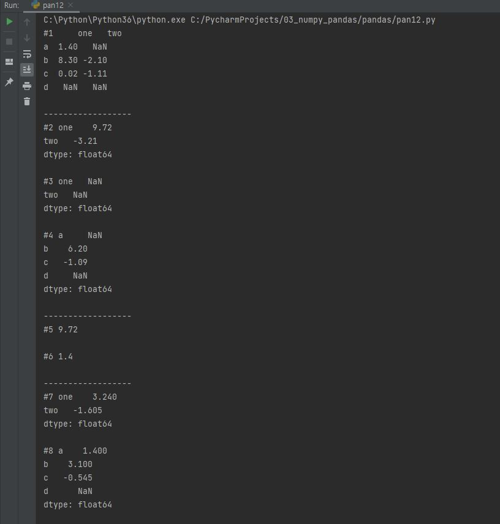


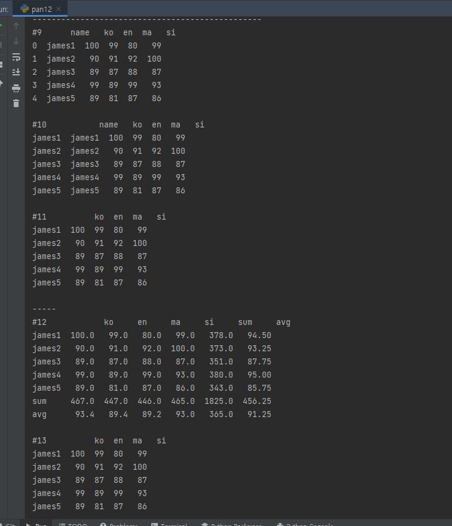

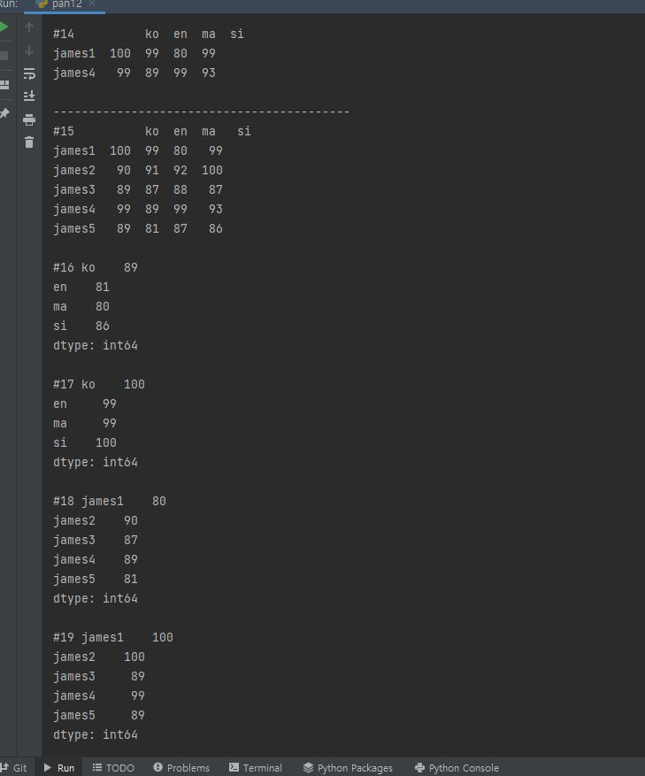

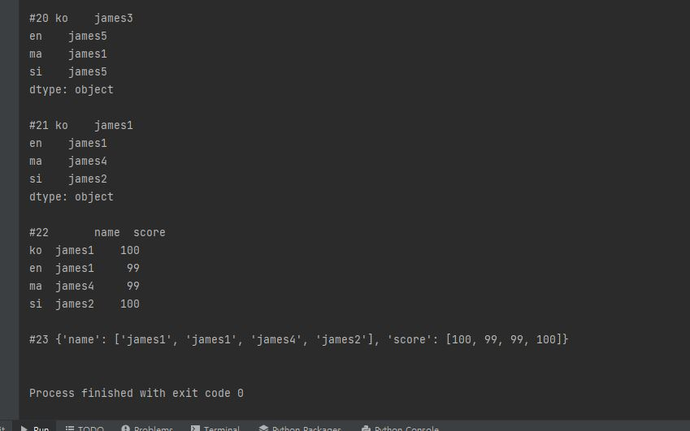


## 실습 13. 기타 유용한 함수

- `isnull()` : null 인 값에 True 리턴
- `notnull()` : null 이 아닌 값에 True 리턴
- `any()` : True가 하나라도 있으면 True 리턴
- `all()` : 모두가 True여야만 True 리턴
- `sort_index()`: 인덱스를 기준으로 데이터프레임을 정렬
- `sort_index(axis=1)` : axis 값을 수정하여 열을 기준으로 정렬 가능
- `sort_values()` : 열에 있는 값을 기준으로 정렬
- `sort_values(by='컬럼값', ascending=False)` : 오름차순을 뜻하는 ascending을 False로 두면 내림차순 정렬
- `unique()` : 해당 열에 있는 값들을 유일하게 확인(중복 제거)
- `transpose()`: 전체 데이터프레임의 행/열을 뒤집는다
- `isin()` : 해당 값이 해당 열에 존재하는지 확인

```python
import pandas as pd
import numpy as np

s1 = pd.date_range('20210114', periods=6)
print('#1', s1, '\n')

s1 = np.random.permutation(s1)
print('#2', s1, '\n')

s2 = list('DBCA') #['','','','']
y = pd.DataFrame(np.random.randint(0, 100, (6, 4)), index=s1, columns=s2)
print('#3', y, '\n')

y1 = y.sort_index(axis=0, ascending=False)
print('#4', y1, '\n')

y2 = y.sort_index(axis=1, ascending=False)
print('#5', y2, '\n')
print('---------------------------------')

y3 = y.sort_values(by='A', ascending=False)
print('#6', y3, '\n')

y['E'] = np.random.randint(0, 5, size=6)
print('#7', y, '\n')
print('#8', y['E'].unique(), '\n')
print('--------------------------------------')

yy = y.transpose()
print('#9', yy, '\n')
print('#10', yy.loc['E'].isin([2, 1]))
```

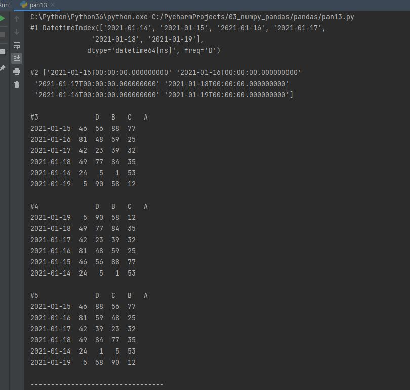

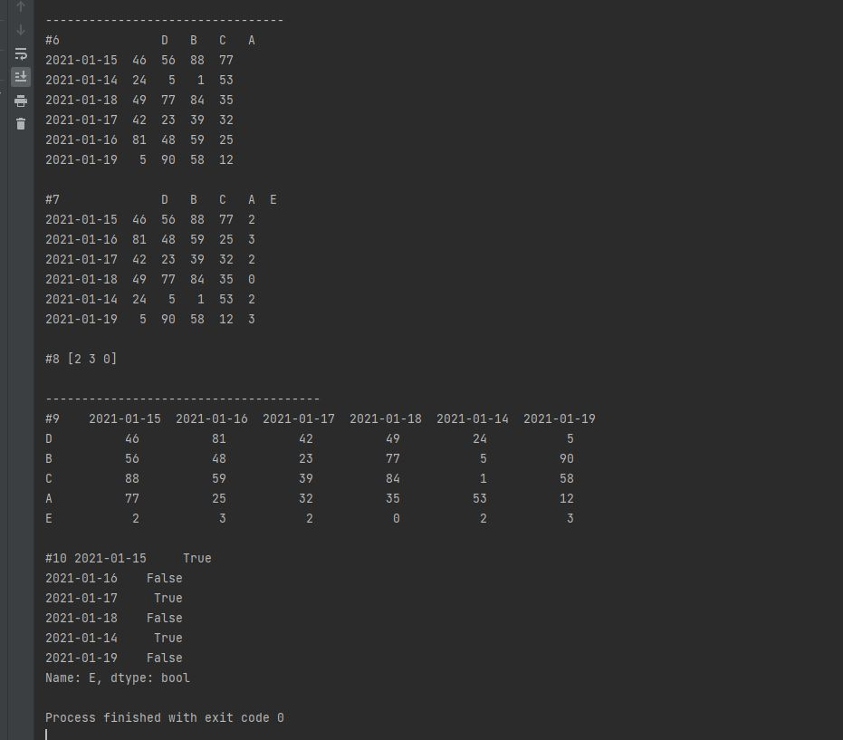


## 실습 14. DataFrame 결합1

- 결합 : 두 개 이상의 DataFrame을 서로 이어 붙이는 것
- `pd.concat([df1, df2])` : 행이 늘어난다. (행 밑으로 붙인다.)
- `pd.concat([df1, df2], axis=1)` : 열이 늘어난다. (열 오른쪽으로 붙인다.)

```python
import pandas as pd
import numpy as np

x1 = pd.DataFrame(np.random.randint(0, 100, (3, 4)), columns=list('ABCD'), index=np.arange(3))
x2 = pd.DataFrame(np.random.randint(100, 200, (3, 4)), columns=list('ABCD'), index=np.arange(3)+3)
x22 = pd.DataFrame(np.random.randint(100, 200, (3, 4)), columns=list('ABCD'), index=np.arange(3))
print('#1', x1, '\n')
print('#2', x2, '\n')

x3 = pd.concat([x1, x2], axis=0)
print('#3', x3, '\n')

x4 = pd.concat([x1, x2], axis=1)
print('#4', x4, '\n')

x5 = pd.concat([x1, x22], axis=1)
print('#5', x5)
```

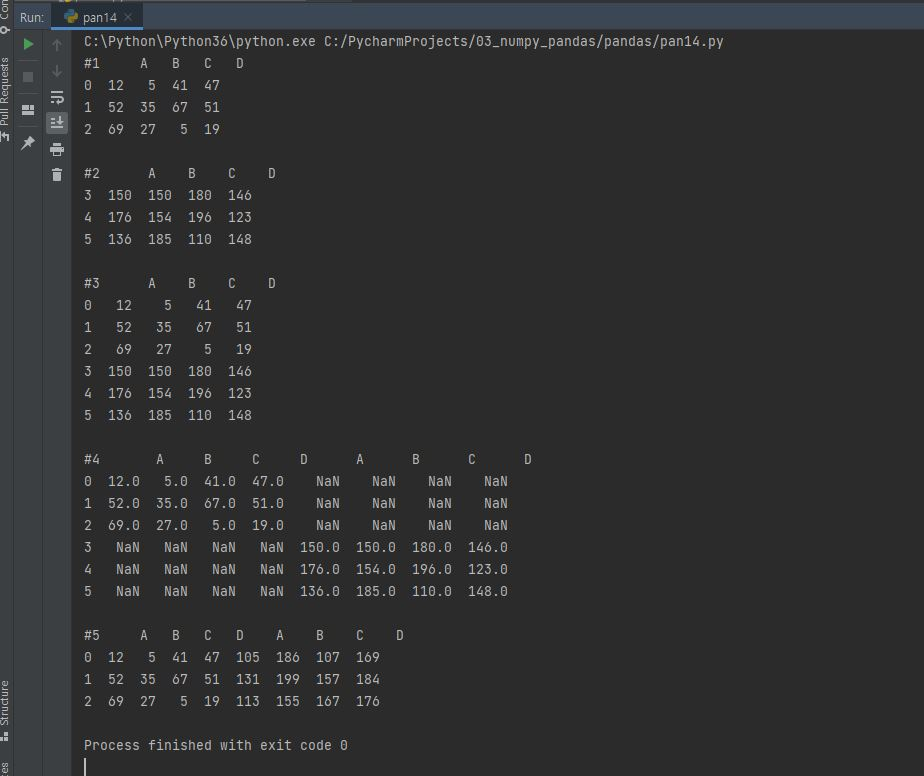


## 실습 15. DataFrame 결합2

- `pd.concat([df1, df2], ignore_index=True)` : ignore_index 속성에 True를 넣으면 인덱스가 새로 부여된다.

```python
import pandas as pd
import numpy as np

x1 = pd.DataFrame(np.random.randint(10, 100, (3, 4)), columns=list('ABCD'), index=list('abc'))
x2 = pd.DataFrame(np.random.randint(10, 100, (3, 4)), columns=list('ABCD'), index=list('def'))
print('#1', x1, '\n')
print('#2', x2, '\n')

x3 = pd.concat([x1, x2], ignore_index=True)
dt = pd.date_range('20210614', periods=6)
x3.index = dt
x3['F'] = [1, 2, 3, 4, 5, 6]
print('#3', x3)
```

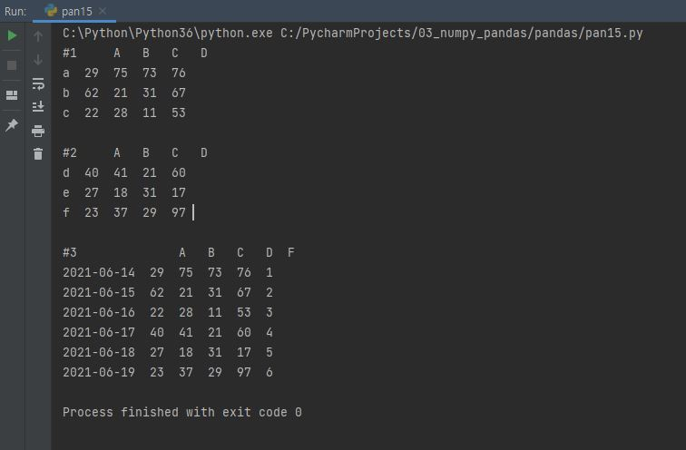


## 실습 16. Series 결합

- series를 결합할 때 axis를 넣게 되면 series를 붙여 dataframe으로 만들 수 있다.
- `keys` 속성을 이용하여 컬럼에 이름을 붙일 수 있다.

```python
import pandas as pd
import numpy as np

x1 = pd.Series([0, 1, 2])
x2 = pd.Series([3, 4, 5])
x3 = pd.Series([6, 7, 8])
x4 = pd.concat([x1, x2, x3], axis=1, keys=list('abc'))
print('#1', x4, '\n')

df1 = pd.DataFrame(np.arange(12).reshape(3, 4), columns=list('ABCD'), index=np.arange(3))
df2 = pd.concat([x4['a'], df1], axis=1, ignore_index=True)
df2.columns = ['a', 'b', 'c', 'd', 'e']
print('#2', df2, '\n')

df3 = pd.concat([df1, x4['a']])
print('#3', df3)
```

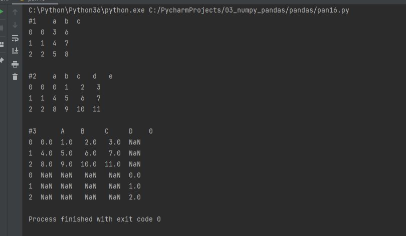


## 실습 17. merge함수, join함수 결합

1. merge
   - `pd.merge(df1, df2, how='left', on='컬럼값', indicator=True, suffixes=('left', 'right'))`
   - `how` : 어떤 dataframe을 기준으로 합칠지를 결정
   - `n = '컬럼값'` 는 기준이 되는 dataframe의 '컬럼값'에 있는 값만 가져오겠다.
   - merge 함수는 기본적으로 inner
     - `how='outer'` 할 경우, 모든 값들에 대한 결과를 내고 값이 없는 부분에 대해 결측값을 낸다.
     - `how='inner'` 할 경우, 결측값이 나올만한 경우를 제거(행 제거)
   - `indicator` : 어느 dataframe에서 온 값인지 맨 뒤에 _merge 칼럼으로 표시
   - `suffixes` : 이름이 겹치게 되는 속성에 대해 뒤에 이름을 결정
     - `suffixes=('left', 'right')`
     - c_x, c_y => left, right
2. join
   - merge 함수보다 간단하게 작성할 수 있다.
   - merge 함수
     - `pd.merge(df1, df2, left_index=True, right_index=True, how='left')` : left 결합
     - `pd.merge(df1, df2, left_index=True, right_index=True, how='right')` : right 결합
     - `pd.merge(df1, df2, left_index=True, right_index=True, how='inner')`
     - `pd.merge(df1, df2, left_index=True, right_index=True, how='outer')`
     - `pd.merge(df3, df4, left_on='i', right_index=True, how='left')`
     - `pd.merge(df3, df4, left_on='i', right_index=True, how='right')`
     - `pd.merge(df3, df4, left_on='i', right_index=True, how='inner')`
     - `pd.merge(df3, df4, left_on='i', right_index=True, how='outer')`
   - join 함수
     - `df1.join(df2, how='left')` : left 결합
     - `df1.join(df2, how='right')` : right 결합
     - `df1.join(df2, how='inner')`
     - `df1.join(df2, how='outer')`
     - `df3.join(df4, on='i', how='left')`
     - `df3.join(df4, on='i', how='right')`
     - `df3.join(df4, on='i', how='inner')`
     - `df3.join(df4, on='i', how='outer')`


```python
import pandas as pd

df1 = pd.DataFrame({'a': [10, 11, 12, 13], 'b': [20, 21, 22, 23]}, index=[0, 1, 2, 3])
df2 = pd.DataFrame({'c': [32, 33, 34, 35], 'd': [42, 43, 44, 45]}, index=[2, 3, 4, 5])
print('#1', df1, '\n')
print('#2', df2, '\n')

df3 = df2.join(df1, how='left')
print('#3', df3, '\n')

df4 = pd.concat([df2, df1], axis=1)
print('#4', df4, '\n')
```

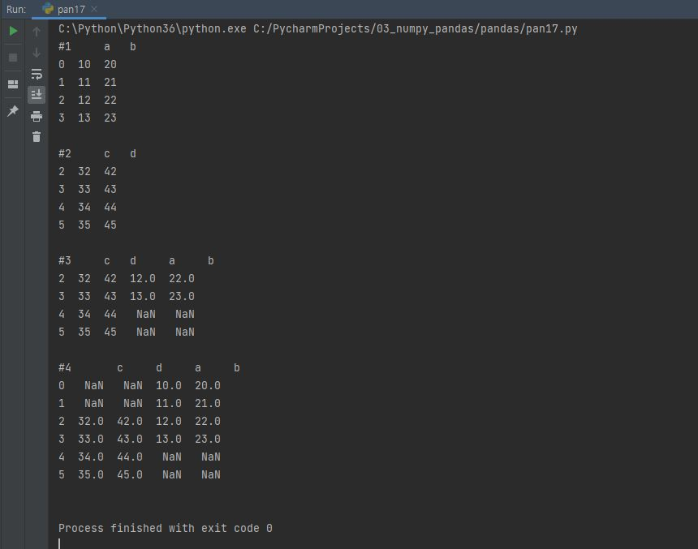


## 실습 18. 파일 입출력

- `df.to_csv('파일명', sep=',', na_rep='NaN', index=False, header=None)`
- `sep` : 구분자
- `na_rep` : 결측값에 대한 작성 방식
- `index` : 인덱스 표기 여부
- `header` : 칼럼 값이 없는 데이터프레임에 대해 저장하거나 불러올때는 header=None
- `names` : 읽어올 때는 칼럼값을 지정해주고 싶다면 names 속성

```python
import pandas as pd

x = {'subj': ['math', 'comp', 'phys', 'chem', 'biol'], 'score': [100, 95, 85, 75, 80], 'avg': [95.2, 66.1, 69.5, 86.8, 91.2]}
df1 = pd.DataFrame(x, index=list('abcde'))
df2 = df1.reindex(list('abcdef'))
print('#1', df2, '\n')

df2.to_csv('./df2.csv', sep=',', na_rep='NaN')
df2.to_csv('./df2_ind.csv', sep=',', na_rep='NaN', index=False, header=None)

rdf1 = pd.read_csv('./df2_ind.csv', header=None, names=list('ABC'))
print('#2', rdf1,'\n')

tdf1 = rdf1.T
print('#3', tdf1)
```

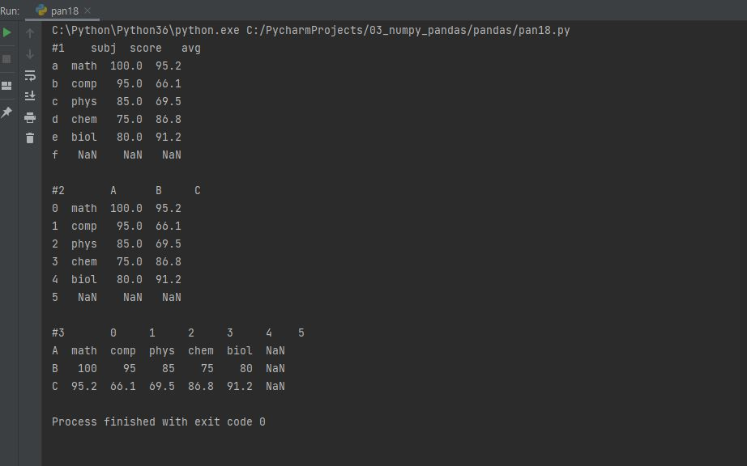

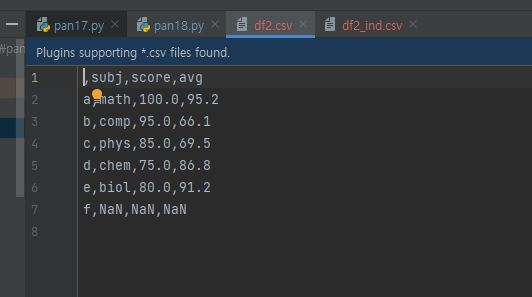

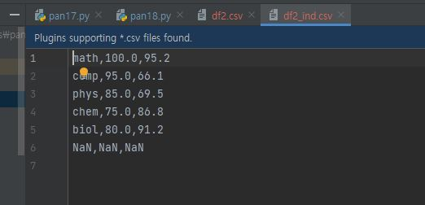


## 실습 19. groupby

```python
import pandas as pd

df1 = pd.DataFrame(
    {
        '상품번호': ['p1', 'P1', 'p2', 'P2'],
        '수량': ['3,000', '2,000', '5,000', '6,000']
    }
)
print(df1, '\n')

df1['상품번호'] = df1['상품번호'].str.upper()   # 대문자 일괄처리
df1['수량'] = df1['수량'].str.replace(',', '')  # 천단위 일괄처리
df1 = df1.astype({'수량': float})
print(df1, '\n')

gdf1= df1.groupby(by=['상품번호'], as_index=False).sum()    # 상품번호로 그룹화 후 sum
print(gdf1, '\n')

gdf1= df1.groupby(by=['상품번호'], as_index=False).mean()   # 상품번호로 그룹화 후 mean
print(gdf1, '\n')

df1['고객번호'] = ['C1', 'C2', 'C2', 'C2']
print(df1, '\n')

new_df1 = df1.groupby(by=['고객번호', '상품번호'], as_index=False).count()  # 고객번호와 상품번호로 그룹화 후 count
print(new_df1)
```

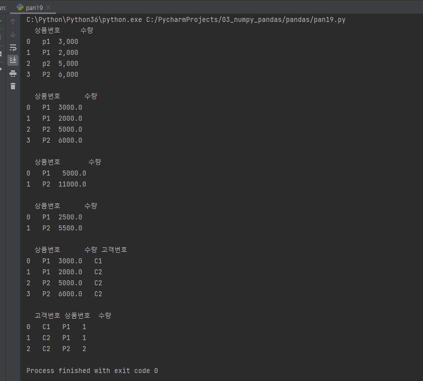


## 실습 20. 타이타닉.csv

- 제공되는 타이타닉 정보를 csv파일로 읽어와 그룹화 및 분석 계산

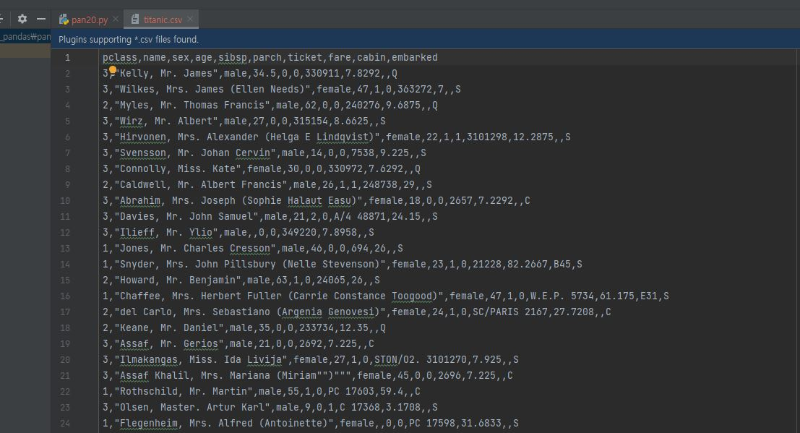

```python
import pandas as pd

t = pd.read_csv('titanic.csv')
print(t.shape)
print(t.columns)

# 등급별 인원
t1 = t.groupby(by=['pclass', 'sex'], as_index=False).count()
print(t1)

# 등급별 연령의 평균
t1 = t.groupby(by=['pclass', 'sex'], as_index=True).mean()['age']
print(t1)
```

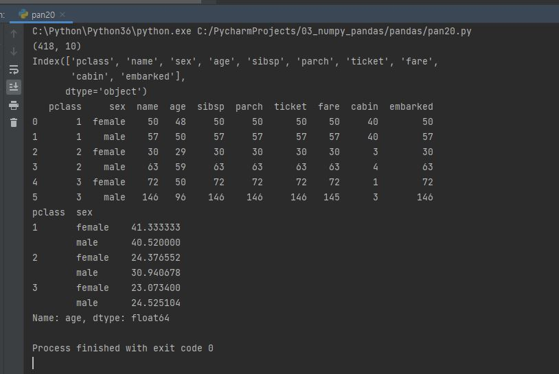


## 실습 21. 타이타닉2.csv

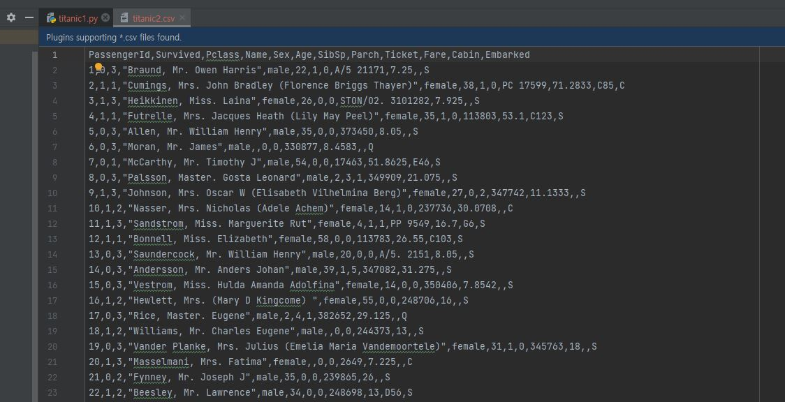

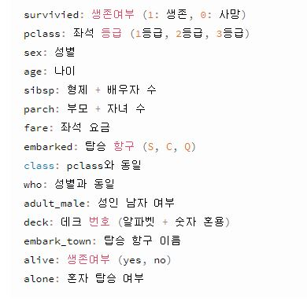

```python
import pandas as pd

df = pd.read_csv('titanic2.csv')
print('#1', df, '\n')

def t1(feature):
    survived = df[df['Survived'] == 1][feature].value_counts()  # 생존자
    dead = df[df['Survived'] == 0][feature].value_counts()  # 사망자
    print('#2', survived, '\n')
    print('#3', dead, '\n')

# t1('Sex')

# group 함수
print('#4', df.groupby('Survived').count(), '\n')
df2 = df.groupby(['Survived', 'Sex']).count()['Pclass']
print('#5', df2, '\n')
print('#6', df2[0].values, '\n')
print('#7', df2[0].values.tolist(), '\n')

# 클래스별 성별 생존율
df3 = df.groupby(['Pclass', 'Sex']).mean()
print('#8', df3, '\n')
print('#9', df3['Survived'], '\n')

# 10세 미만 데이터
df4 = df[df['Age'] < 10].groupby('Sex').count()
print('#10', df4, '\n')
df5 = df[(df['Age'] < 10) & (df['Age'] > 5)].groupby('Sex').mean()['Survived']
print('#11', df5)
```

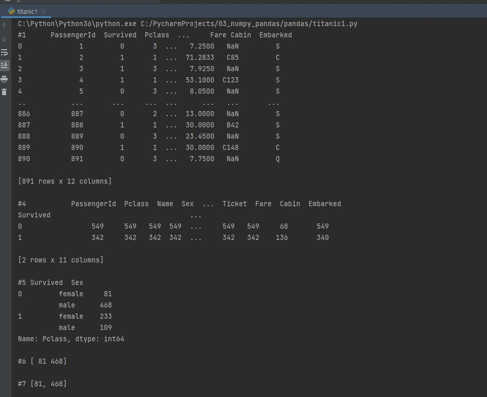

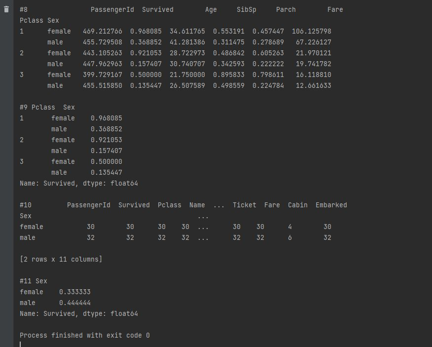

